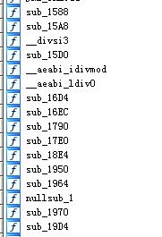
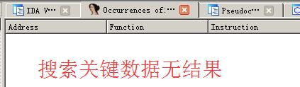
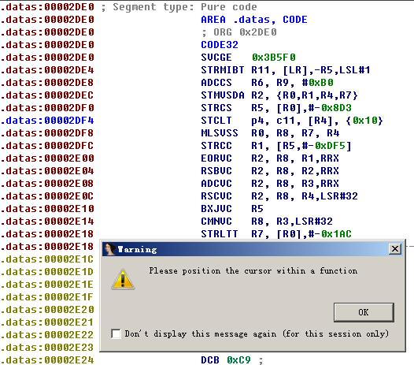

# Android字符串加密库
An Android native library (*.so) which encrypt/decrypt string and proguard it to prevent decompile.

##  特点 Feature

- 正版应用调用校验（防止二次打包等问题）
- 函数名及内容混淆
- 关键代码及字符串隐藏
- 支持自定义加密解密扩展
- 入口防止动态调试等等


## 预览 Preview

下面是正版应用调用展示：


下面是非法应用调用结果（包名或签名不一致）：


下面是反编译后函数列表（混淆）：



下面是搜索关键数据（如加密密钥、加密后的数据）:



下面是关键代码片段反生成代码（加大反编译难度）：




## 用法 Usage

注意：下面均忽略JNI调用的通用步骤

<b>1.配置你的应用签名及包名</b>

&emsp;&emsp;打开Tools.cpp，修改替换sign和validPackage内容，比如签名为：-498576263，包名为：com.github.maxwell.nc.nativestrencrypt，则可以修改为如下代码：
```c
//正版签名hashcode，换签名请修改这个
//忽略hashcode碰撞问题（另外有包名校验）
//必须是使用tricks写法，直接int可以从so中静态反编译找到（容易被替换）
char* sign = (char[]){'-','4','9','8','5','7','6','2','6','3'};
int vaildSignHash = atoi(sign);

//正版包名
//可以任意分割，见nstrcat
const char* validPackage =  nstrcat("com","co","m",".","gi","thub",".","max","we","ll",
                                    ".","nc",".","native","str","encrypt","com");
```
&emsp;&emsp;如果你不确定你的包名和签名，可以通过打开日志信息，观察日志中生成的hashcode和sign即为当前应用的签名hashcode及包名。

<b>2.配置你的原生函数</b>

&emsp;&emsp;由于是采用反射获取方法名称，需要通过配置regClazz（调用原生方法的包名）和gMethods（原生方法名、方法签名、函数指针），然后参考getSamplePass函数调用decryptStr方法进行解密：
```c
__attribute__((section ("datas")))
JNICALL jstring getSamplePass(JNIEnv *env, jclass clazz, jobject object){
    //这里的 616263898b8a 为加密后的字符串（可以任意分割）
    return decryptStr(env,object,"616","263","8","98","b8a",fakePass);
}

//要寻找的类：配置你的包名
static char regClazz[] = "com/github/maxwell/nc/encryptlib/EncryptUtils";

//要寻找的方法：配置你的方法
static JNINativeMethod gMethods[] = {
        { "getSamplePass", "(Ljava/lang/Object;)Ljava/lang/String;", (void*)getSamplePass },
};
```


<b>3.调用原生方法</b>
```java
String samplePass = EncryptUtils.getSamplePass(this);
```
如果错误则会返回预定义错误的字符串

<b>4.特别注意！！！</b>

源代码中加密解密方法随便写的，十分简单，不能用于实际应用。建议采用高强度加密解密算法（最好修改通用方法，加强安全）

## 进阶 Advance

<b>打开日志信息</b>

&emsp;&emsp;可以通过修改Tools.h中的宏定义：
```c
#define DEBUG true
```

<b>修改预定义错误返回字符串</b>

&emsp;&emsp;可以通过修改EncryptUtils.cpp中的decryptStr函数中的：
```c
char* failStr = (char[]){'e','r','r','o','r','\0'};
```

<b>其他事项</b>

&emsp;&emsp;暂时没想到，以后有空再补充。

&emsp;&emsp;Sorry, I have no empty time to translate this readme file into English.

